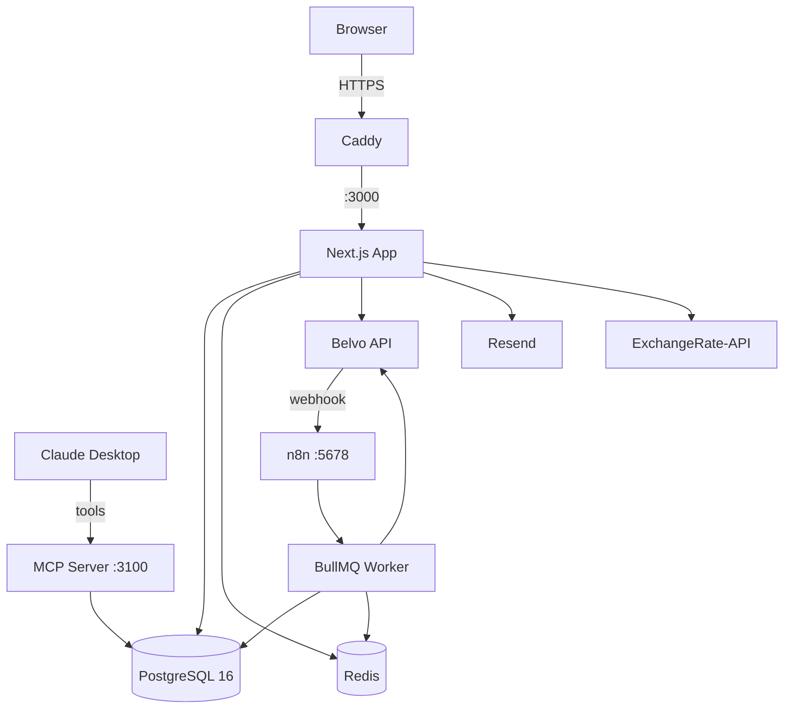
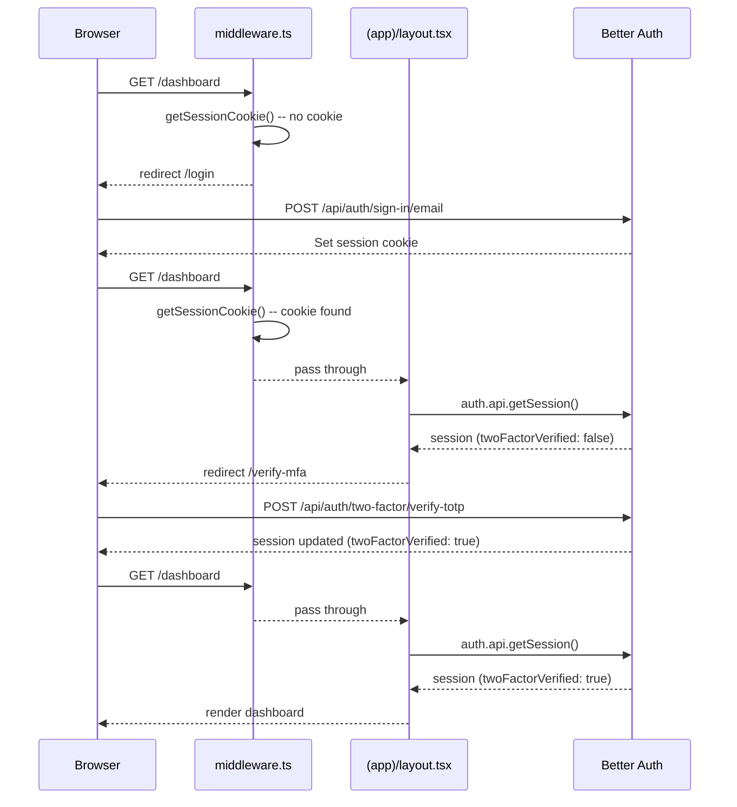

# Cuatro Finance

A self-hosted personal finance web app for my personal finances.

- **Live:** [finance.cuatro.dev](https://finance.cuatro.dev)
- **Demo (public, read-only):** [finance.cuatro.dev/demo](https://finance.cuatro.dev/demo)

---

## Features

- Budget management with proactive overspending alerts
- Expense tracking with automatic Colombian merchant categorization
- Bank sync via Belvo + CSV/OFX import for all others
- Subscription detection and unwanted charge flagging
- Deb optimizer - avalance and snowball methods with payoff projections
- UVR mortgage tracking + AFC tax benefit calculation
- Multi-currency (COP, USD, crypto) with exchange rates locked at transaction time
- Investment portfolio tracking (stocks, ETFs, mutual funds, crypto)
- 90-day cash flow forecasting
- MCP server - query your finances with natural language
- n8n automations for Belvo webhocks and email alerts
- Bank-level encryption (AES-256-GCM) + TOTP MFA
- Demo mode with realistic seeded Colombian financial data

## Tech Stack

| Layer             | Technology                                      |
| ----------------- | ----------------------------------------------- |
| Framework         | Next.js 15 (App Router)                         |
| Language          | TypeScript 5.7                                  |
| UI                | shadcn/ui + Base UI + Tailwind v4               |
| Charts            | Recharts                                        |
| Auth              | Better Auth (TOTP 2FA)                          |
| Database          | PostgreSQL 16 + Prisma 7                        |
| Money arithmetic  | decimal.js (banker's rounding, BIGINT centavos) |
| Background jobs   | BullMQ + Redis                                  |
| Bank connectivity | Belvo                                           |
| Email             | Resend                                          |
| Reserve proxy     | Caddy (auto-HTTPS)                              |
| Validation        | Zod                                             |
| Tests             | Vitest + Playwright                             |
| Deployment        | Docker Compose on Hezner CAX21                  |

## Architecture



---

## Local Development

```shell
# 1. Clone and install
git clone https://github.com/LuigiEspinosa/cuatro-finance
cd cuatro-finance
pnpm install

# 2. Environment
cp .env.example .env.local
# Fill in ENCRYPTION_KEY and BETTER_AUTH_SECRET at minimum

# 3. Start services
docker compose up -d

# 4. Database
pnpm prisma generate
pnpm prisma migrate deploy
pnpm prisma db seed

# 5. Dev server
pnpm dev

# Open http://finance.localhost (Caddy proxies to :3000)

pnpm test        # Vitest unit + integration tests
pnpm test:e2e    # Playwright E2E (requires running app)
pnpm typecheck   # tsc --noEmit
```

## Deployment

Runs on a single VPS via Docker Compose

```shell
# First deploy
git clone https://github.com/LuigiEspinosa/cuatro-finance
cp .env.example .env.local       # Fill all values
docker compose up -d
docker compose exec pnpm prisma generate
docker compose exec pnpm prisma migrate deploy
docker compose exec pnpm tsx prisma/seed/demo.ts
```

Subsequent deploys are handled by Github Actions on push to `main`.

> [!IMPORTANT]
> **Critical**: Back up the PostgreSQL volume daily - it is the only irreplaceable data.

```shell
docker compose exec postgres pg_dump -U finance > backup-$(data +%Y%m%d).sql
```

## Environment Varialbes

| Variable                    | Description                                         |
| --------------------------- | --------------------------------------------------- |
| DATABASE_URL                | PostgreSQL connection string                        |
| REDIS_URL                   | Redis connection URL                                |
| ENCRYPTION_KEY              | 32-byte hex (`openssl rand -hex 32`) - back this up |
| BETTER_AUTH_URL             | Domain connection url                               |
| NEXT_PUBLIC_BETTER_AUTH_URL | Domain connection url                               |
| BETTER_AUTH_SECRET          | 32-char secret (`openssl rand -base64 32`)          |
| ADMIN_EMAIL                 | Admin email                                         |
| ADMIN_PASSWORD              | Admin password                                      |

---

## Auth Flow


